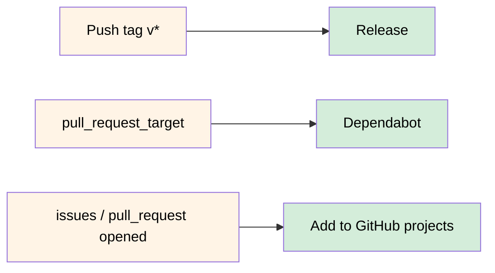

#  Miscellaneous Called Workflows

Reusing workflows avoids duplication. This makes workflows easier to maintain and allows you to create new workflows
more quickly by building on the work of others, just as you do with actions.

Workflow reuse also promotes best practice by helping you to use workflows that are well designed, have already been
tested, and have been proved to be effective. Your organization can build up a library of reusable workflows that can
be centrally maintained.

## Reusing Workflows

Rather than copying and pasting from one workflow to another, you can make workflows [reusable](https://docs.github.com/en/actions/learn-github-actions/reusing-workflows). You and anyone with access to the reusable workflow can then call the reusable workflow from another workflow.

### Workflows

- [add-to-project.yml](.github/workflows/add-to-project.yml)
- [build-and-push](.github/workflows/build-and-push.yml)
- [dependabot.yml](.github/workflows/dependabot.yml)
- [nuclei.yml](.github/workflows/nuclei.yml)

